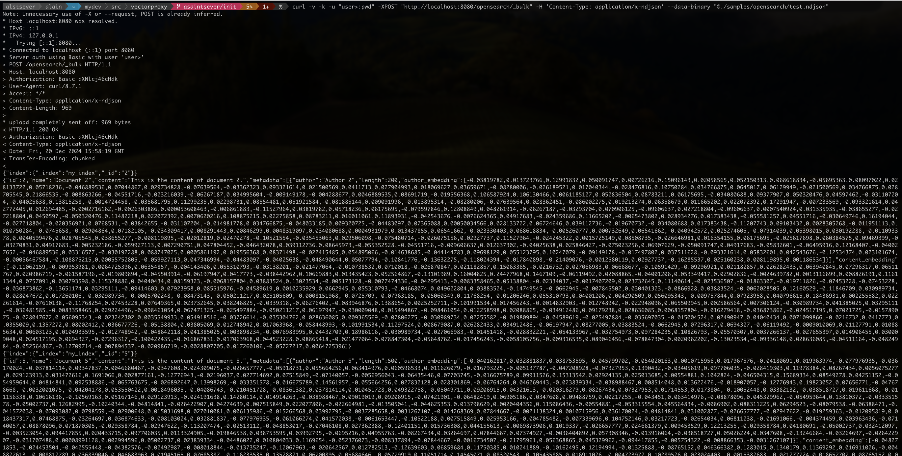

# Vector Proxy (VP)

VP is a service that acts as a proxy between an ingest script/pipeline and the vector store. It is responsible for computing or delegating vectorization and then sending the vectorized data to the vector store.

> [!NOTE]
> VP proxies all calls to the vector store. Only indexing calls are modified to include the vectorized data in the payload, other calls being directly forwarded to the vector store.

> [!IMPORTANT]
> VP will enrich your source document with embeddings for the fields you specify. Each embedding will be added to the document using the name of the original field with the suffix `_embedding`.
>
> For example, if you ask VP to embed the `content` field, the resulting vector will be added to the payload as `content_embedding`.

## Features

Currently supported vector stores and vectorization methods:

| Proxy Vector Store API | Delegated Vectorization | Local Vectorization |
|------------------------|-------------------------|---------------------|
| OpenSearch/Elasticsearch Bulk API | Amazon Bedrock | - |

## Build

```bash
make build-vp
```

Binaries are generated in the `src/target/` directory.

## Usage

```bash
vectp -h
```

## Examples

### Elasticsearch/OpenSearch as Vector Store

To compute vectors from a [sample NDJSON file](./samples/opensearch/test.ndjson):

- Start proxy first (in dry mode here just to see the computed vectors):

    ```bash
    vectp -embeddings-dimension 256 -gjson-paths content,metadata.#.author -dry-run
    ```

    > [!NOTE]
    > Here we ask the proxy to vectorize the `content` and `metadata.author` fields. The vectors are computed using the default embedding model and have a dimension of 256.

- Then send the NDJSON data to the proxy, the same way as you would send it to Elasticsearch/OpenSearch (via Bulk API):

    ```bash
    curl -v -k -u "<USER>:<PWD>" -XPOST "http://localhost:8080/opensearch/_bulk" -H 'Content-Type: application/x-ndjson' --data-binary "@./samples/opensearch/test.ndjson"
    ```

The proxy output will look like this:


While the enriched payload with vectors will look like:



**As the vector proxy is running in dry-run mode, the data is not actually sent to the vector store**: the output is just a preview of the enriched payload that would have been sent to the vector store. To send the data to the vector store, stop vector proxy and restart it without the `-dry-run` flag.

## GJSON Path Syntax

VP uses the GJSON Path syntax to extract the data from the JSON payload. The syntax is similar to the JSON Path syntax but with some differences.

See the [GJSON Path syntax documentation](https://github.com/tidwall/gjson/blob/master/SYNTAX.md) for more information and [GJSON playground](https://gjson.dev/) to experiment with the syntax.
